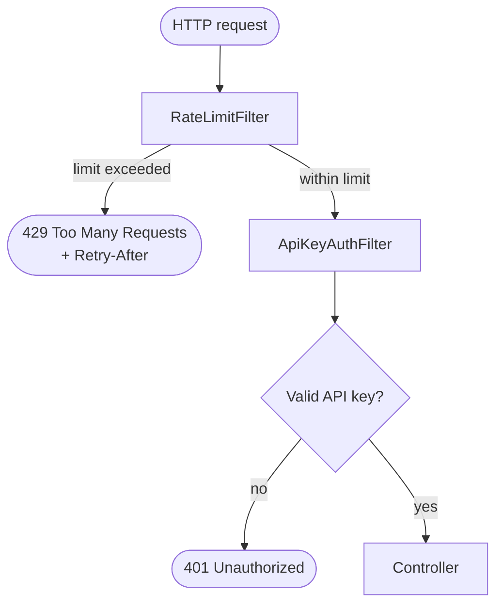
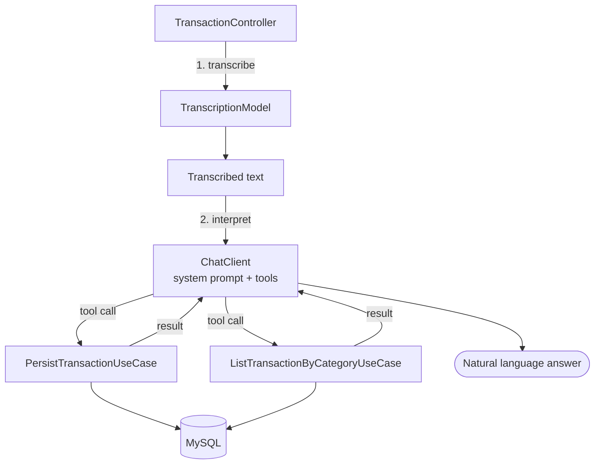

# 💸 FinancialAI

**An AI-powered personal finance assistant built with Java and Spring Boot.**

Register expenses through a REST API — or just send an audio saying what you spent.


---

## 📌 About

FinancialAI lets users register what they spent and then understands messages like:

> *"Gastei 35 reais na padaria." · "Paguei 80 reais na farmácia." · "Comprei um fone online por 150 reais."*

> *"I spent 35 reais at the bakery." · "I paid 80 reais at the pharmacy." · "I bought headphones online for 150 reais."*

The core idea of the project is a **strict separation of responsibilities**:

> 🧠 **The AI interprets what the user said.**
> ⚙️ **Java decides what can actually be executed and persists the data.**
> 🔐 **A security layer decides who may ask, and how often.**

The model never touches the database. It can only call the **tools** that Java exposes — each one backed by a regular use case — and every request reaches the model only after it has passed authentication and rate limiting.

This project was built as a portfolio project for a bootcamp. After the first working version, I focused on a question that most tutorials skip: *what happens when someone other than me calls this API?*

## 📑 Table of Contents

- [What changed in this version](#-what-changed-in-this-version)
- [Technologies](#-technologies)
- [Features](#-features)
- [Security](#-security)
- [The process](#-the-process)
- [What I learned](#-what-i-learned)
- [How can it be improved](#-how-can-it-be-improved)
- [Running the project](#-running-the-project)

---

## 🆕 What changed in this version

The first version had a working AI flow but **no protection at all**: every endpoint was open, including the ones that call the language model. Anyone who found the URL could spend the model quota (which, on a free plan, is small) or write transactions into the database.

This version adds (and removes):

| Change | Why |
| --- | --- |
| **Experimental endpoints removed** (`/chatmodel`, `/api/chat`, `/api/transcribe`) | They forwarded raw prompts to the model with no business purpose, which only enlarged the attack surface |
| **API key authentication** (`X-API-Key` header, Spring Security, stateless) | Only clients that know the key can use the API |
| **Rate limiting by client IP**, with a stricter limit for AI endpoints | Protects the model quota and slows down abuse |
| **Rate limit before authentication** | Guessing the key is also throttled |
| **Fail-fast configuration** | The app refuses to start with a missing or short API key |
| **Upload size limit** (2 MB) | Audio files cannot exhaust memory or bandwidth |
| **Secrets only through environment variables** | No keys in the repository |
| **Everything configurable by properties** | Limits change without touching the code |

---

## 🛠 Technologies

| Area | Technology |
| --- | --- |
| Language | Java 21 |
| Framework | Spring Boot 4.1.1 |
| AI integration | Spring AI 2.0.1 via OpenRouter (OpenAI-compatible API) |
| Security | Spring Security (stateless API key) + custom rate limiter |
| Database | MySQL 9.6 (Docker Compose) |
| Persistence | Spring Data JPA + Hibernate |
| Build | Gradle |
| Utilities | Lombok |
| Tools | IntelliJ IDEA, Insomnia, curl |

Spring AI's `ChatClient` connects the application to the model and registers the use cases as **tools** the model may call. Spring AI's `TranscriptionModel` turns an audio file into text.

---

## 🚀 Features

### 💳 Transactions

A Transaction is a financial record.

- Identified by a UUID
- Description and amount
- Category: `GROCERIES`, `PHARMA`, `E_BUY`

| Method | Endpoint | Purpose |
| --- | --- | --- |
| `POST` | `/transaction` | Create a transaction (JSON body) |
| `GET` | `/transaction/{category}` | List transactions of a category |
| `POST` | `/transaction/ai` | Send an **audio** (multipart `file`); the AI registers or lists transactions |

All of them require the `X-API-Key` header. `/transaction/ai` is the only endpoint that reaches the model, so it is the only one under the stricter AI rate limit.

### 🎙 Voice-driven registration

Send an audio such as *"Gastei 35 reais na padaria"* and the application:

1. transcribes it to text,
2. lets the model interpret the sentence and pick the right tool,
3. executes the matching Java use case,
4. answers in natural language.

Sample audios (`padaria.mp3`, `farmacia.mp3`, `compraVirtual.mp3`) are in `src/main/resources/audios`.

### 🧰 Tools exposed to the model

| Tool | Use case | What it does |
| --- | --- | --- |
| `persist-transaction` | `PersistTransactionUseCase` | Creates and saves a new transaction |
| `list-transaction-by-category` | `ListTransactionByCategoryUseCase` | Lists transactions of a category |

The model can only do what these two tools allow.

> ⚠️ **Known limitation:** the audio flow needs a provider that offers speech-to-text through an OpenAI-compatible endpoint (configured here for `whisper-1`, in Brazilian Portuguese). I could not find a free model for transcription or text-to-speech, so the voice features depend on a provider with access to one. Text-to-speech is not implemented.

---

## 🔐 Security

### Threats and countermeasures

| Threat | Countermeasure |
| --- | --- |
| Anyone calling endpoints that use the model | API key required on every request (`401` otherwise) |
| Exhausting the free model quota | Rate limiting, much stricter on AI endpoints |
| Brute-forcing the API key | Rate limiting runs **before** authentication; keys need 32+ characters |
| Timing attacks on the key comparison | Constant-time comparison (`MessageDigest.isEqual`) |
| Bypassing the limit by forging `X-Forwarded-For` | The limiter uses only the real connection address |
| Oversized uploads | Multipart limits of 2 MB |
| Leaked secrets | Environment variables only; nothing sensitive in the repository |

### API key authentication

- The client sends `X-API-Key: <key>` on each request.
- The server is **stateless**: no session, no cookies. That is also why CSRF protection is disabled — there is no ambient credential for a browser to send on its own.
- Only one mechanism is enabled: HTTP Basic, form login and logout are turned off to reduce the attack surface.
- Without a valid key, the response is `401 Unauthorized` with an empty body.
- The key is read from `APP_API_KEY`. **If it is missing or shorter than 32 characters, the application does not start.**

### Rate limiting

- Counts requests **per client IP** in a fixed time window (1 minute).
- Two independent tiers:

| Tier | Endpoints | Default limit |
| --- | --- | --- |
| AI | `/transaction/ai` | **5 requests/minute** |
| General | everything else | **60 requests/minute** |

- When exceeded, the request is stopped before reaching the controller — the model is never called:

```
HTTP/1.1 429 Too Many Requests
Retry-After: 30
Content-Type: application/json

{"error":"rate_limit_exceeded"}
```

- Thread-safe: each counter update is atomic, so concurrent requests cannot slip past the limit.

### Configuration

| Property | Default | Description |
| --- | --- | --- |
| `app.security.api-key` | `${APP_API_KEY}` | The API key (min. 32 characters) |
| `app.rate-limit.general.requests-per-minute` | `60` | Limit for regular endpoints |
| `app.rate-limit.ai.requests-per-minute` | `5` | Limit for AI endpoints |
| `spring.servlet.multipart.max-file-size` | `2MB` | Max size of an uploaded file |
| `spring.servlet.multipart.max-request-size` | `2MB` | Max size of a multipart request |

### Known limitations

These are conscious trade-offs, not oversights:

- **State is in memory.** Counters live in one instance and reset on restart; with several instances each would count separately.
- **Fixed window** allows a short burst (up to twice the limit) at a window boundary.
- **One shared key, no users.** Transactions have no owner; anyone with the key sees everything.
- **Behind a reverse proxy**, all clients would share the proxy's address until trusted proxy headers are configured.

---

## 🔄 The process

Every request goes through the same pipeline before any business code runs.



### 1. Rate limiting — the first gate

`RateLimitFilter` picks the AI or the general limiter from the request path and asks `FixedWindowRateLimiter` whether this client may continue. Doing this first means a flood of requests, even invalid ones, never reaches authentication or the model.

### 2. Authentication

`ApiKeyAuthFilter` only **identifies**: if the header matches, it marks the request as authenticated. It never rejects anything itself. The rejection comes from the authorization rule (`anyRequest().authenticated()`), which answers `401`. Identifying and deciding are separate responsibilities.

### 3. The AI flow

For `POST /transaction/ai`, once the request is allowed in:



For example, the audio *"Gastei 35 reais na padaria"* is transcribed, and the model decides to call:

```json
{
  "tool": "persist-transaction",
  "arguments": { "description": "Padaria", "category": "GROCERIES", "amount": 35 }
}
```

Java executes the use case, saves the record, and the result goes back to the model, which writes the final answer. **The model proposes; Java executes.**

### 4. Business logic and layers

The code is organized in layers with a one-way dependency:

```
domain          Transaction, TransactionID, Category, TransactionRepository
application     PersistTransactionUseCase, ListTransactionByCategoryUseCase
infrastructure  HTTP controllers, JPA persistence, security, rate limiting, configuration
```

Security and rate limiting live in the infrastructure layer on purpose: they are HTTP concerns, so the domain and use cases did not change at all.

---

## 📚 What I learned

### The Spring Security filter chain

A request crosses a chain of filters before reaching the controller. Each filter can pass it on or stop it. Writing my own filters and placing them in the right order made it clear **where** each decision happens.

### Authentication vs. authorization

Authentication answers *"who are you?"* and authorization answers *"may you enter?"*. My filter only authenticates; a separate rule authorizes. Keeping them apart is a core Spring Security idea.

### Rate limiting algorithms and their trade-offs

Fixed window, sliding window and token bucket solve the same problem with different costs. I chose the fixed window for its simplicity and learned exactly what it gives up (the boundary burst), and what would change in a distributed setup (a shared store such as Redis).

### Concurrency

Two requests from the same client can arrive at the same instant. A plain read-then-write on a counter loses updates. Using `ConcurrentHashMap.compute` together with **immutable** `record`s makes the update atomic without explicit locks.

### Time as a dependency

The limiter receives a `Clock` instead of reading the system time itself, which makes time-based behavior controllable and testable.

### Security details that matter

- Comparing secrets in **constant time**, so response time reveals nothing about the key.
- Never trusting a client-controlled header (`X-Forwarded-For`) to identify the client.
- **Failing fast** on weak configuration instead of running unprotected.
- Disabling CSRF only because the API is stateless and uses no cookies — not as a reflex.

### Secrets management

Keys belong in environment variables, never in the repository. I also learned that a `.gitignore` entry does **not** protect a file that Git already tracks, and that a leaked key must be treated as compromised and replaced.

### Spring AI with tool calling

Exposing use cases as tools lets the model act without ever touching the database. It also showed me that the model's arguments are **input from an untrusted source** and deserve the same care as any user input.

### Testing the protections by hand

I validated the behavior with curl and Insomnia: `401` without a key, `200` with it, and `429` once the limit was exceeded.

---

## 🔮 How can it be improved

| Improvement | Description |
| --- | --- |
| **Per-user authentication** | Replace the shared key with JWT or OAuth2, and give each transaction an owner so users only see their own data. |
| **Distributed rate limiting** | Move to a token bucket (for example Bucket4j) backed by Redis, so limits hold across several instances and restarts. |
| **Validation of AI input** | Reject non-positive amounts, empty or oversized descriptions and unknown categories inside the domain, so bad tool arguments never reach the database. |
| **Audio upload validation** | Check content type and file signature, not just size. |
| **Automated security tests** | Unit tests for the limiter with a fake clock, and integration tests for `401` / `429` through the real filter chain. |
| **Voice interaction** | Speech-to-text and text-to-speech with a provider available to me, for a full voice loop. |
| **Observability** | Replace `System.out` with structured logging and track rate-limit hits and authentication failures. |
| **Deployment** | Run it behind HTTPS and a reverse proxy, with trusted forwarded headers and secrets from the platform's secret store. |
| **Frontend** | A dashboard with expenses per category and a recording button. |

---

## 🏁 Running the project

### Requirements

- Java 21
- Docker (for the MySQL container)
- Git
- An [OpenRouter](https://openrouter.ai) API key
- IntelliJ IDEA (or another Java IDE)

### 1. Clone the repository

```bash
git clone https://github.com/G-Delboni/SpringAiFinancial.git
cd SpringAiFinancial
```

### 2. Set the environment variables

Never commit secrets. Define these as environment variables (or in a local, untracked `.env` for Docker Compose):

| Variable | Purpose |
| --- | --- |
| `OPENROUTER_API_KEY` | Access to the model provider |
| `APP_API_KEY` | The key clients must send in `X-API-Key` (min. 32 characters) |
| `MYSQL_ROOT_PASSWORD` | MySQL root password |
| `MYSQL_PASSWORD` | Password of the application's database user |

Generate a strong `APP_API_KEY` locally (any of these works):

```bash
# Java (JDK 21)
jshell
jshell> var b = new byte[32]; new java.security.SecureRandom().nextBytes(b); java.util.HexFormat.of().formatHex(b)

# Python
python -c "import secrets; print(secrets.token_hex(32))"
```

On Windows, define variables permanently under *Environment Variables* (user level), then **restart the terminal and the IDE** so they pick them up.

### 3. Run the application

```bash
./gradlew bootRun
```

On Windows:

```bash
gradlew.bat bootRun
```

Spring Boot starts the MySQL container from `docker-compose.yaml` automatically. The API will be available at `http://localhost:8080`.

### 4. Try it

```bash
# List transactions of a category
curl -H "X-API-Key: $APP_API_KEY" http://localhost:8080/transaction/GROCERIES

# Create a transaction
curl -X POST http://localhost:8080/transaction \
  -H "X-API-Key: $APP_API_KEY" \
  -H "Content-Type: application/json" \
  -d '{"description":"Supermarket","category":"GROCERIES","amount":50}'

# Register an expense from an audio
curl -X POST http://localhost:8080/transaction/ai \
  -H "X-API-Key: $APP_API_KEY" \
  -F "file=@src/main/resources/audios/padaria.mp3"
```

In PowerShell use `curl.exe` (plain `curl` is an alias for another command) and `$env:APP_API_KEY`.

### 5. Test the protections

| What to do | Expected result |
| --- | --- |
| Call any endpoint **without** the header | `401` |
| Call with a wrong key | `401` |
| Call `/transaction/GROCERIES` with the right key | `200` |
| Send 6 requests to `POST /transaction/ai` within a minute | the 6th returns `429` with `Retry-After` |
| Send 65 requests to a regular endpoint within a minute | the last ones return `429` |

> 💡 Rate limiting runs before authentication, so you can test the AI limit by sending `POST /transaction/ai` **without the key header** (`401` ×5, then `429`) and never spend the model quota.

---

Built by **Gabriel Delboni Dias** ·
[LinkedIn](https://www.linkedin.com/in/gabriel-delboni-dias/) ·
[GitHub](https://github.com/G-Delboni)
